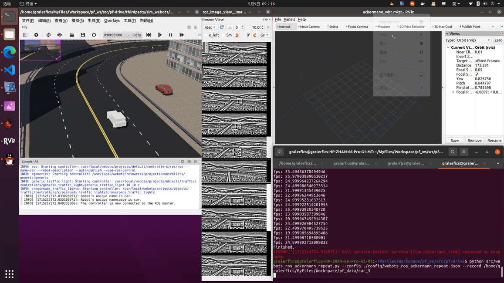
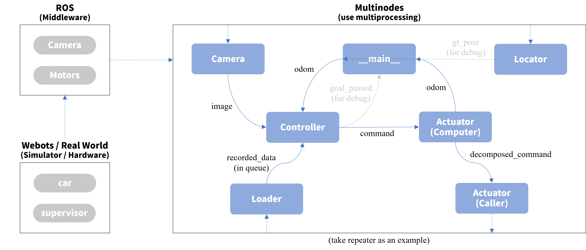

# pf-drive
Path following navigation.



## Information

**Language**: Python

**OS**: Ubuntu 20.04

**Simulator**: Webots

## Reference

Dall’Osto, D., Fischer, T., & Milford, M. (2020). Fast and Robust Bio-inspired Teach and Repeat Navigation. *2021 IEEE/RSJ International Conference on Intelligent Robots and Systems (IROS)*, 500-507.

## Structure



(TODO)

## Usages

### Launch

#### Ackermann Car In Webots

1. Start the simulator:

```bash
roslaunch pf_drive ackermann_wbt.launch
```

2. Start recording the data:

```bash
python src/webots_ros_ackermann_record.py [--config, -c ...]
```

For example:

```bash
python src/webots_ros_ackermann_record.py --config ./config/webots_ros_ackermann_record.json --output /home/gralerfics/MyFiles/Workspace/pf_data/car_x
```

> Keyboard control: left, right, up and down arrow keys; space bar to brake; z to reset the steering angle.

3. Start replaying the data:

```bash
python src/webots_ros_ackermann_repeat.py [--config, -c ...] [--record, -r ...]
```

For example:

```bash
python src/webots_ros_ackermann_repeat.py --config ./config/webots_ros_ackermann_repeat.json --record /home/gralerfics/MyFiles/Workspace/pf_data/car_2
```

### Evaluate

#### evo

```bash
evo_traj kitti repeat_traj.txt --ref=record_traj.txt -p --plot_mode=xy
evo_ape kitti record_traj.txt repeat_traj.txt --plot --plot_mode=xy
```

## Notes

### Memo

TODO
